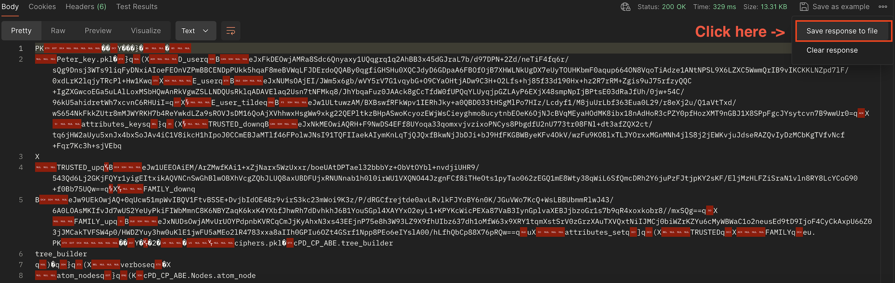
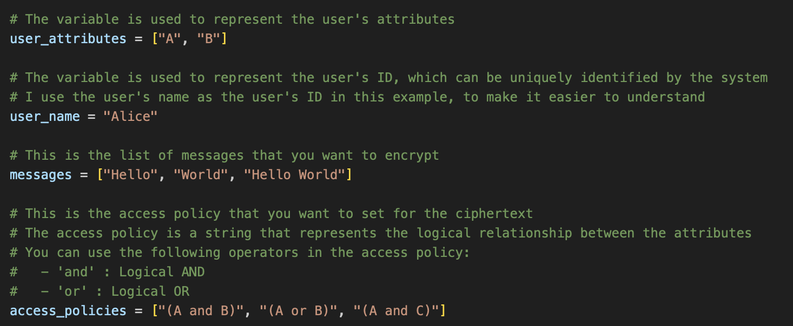
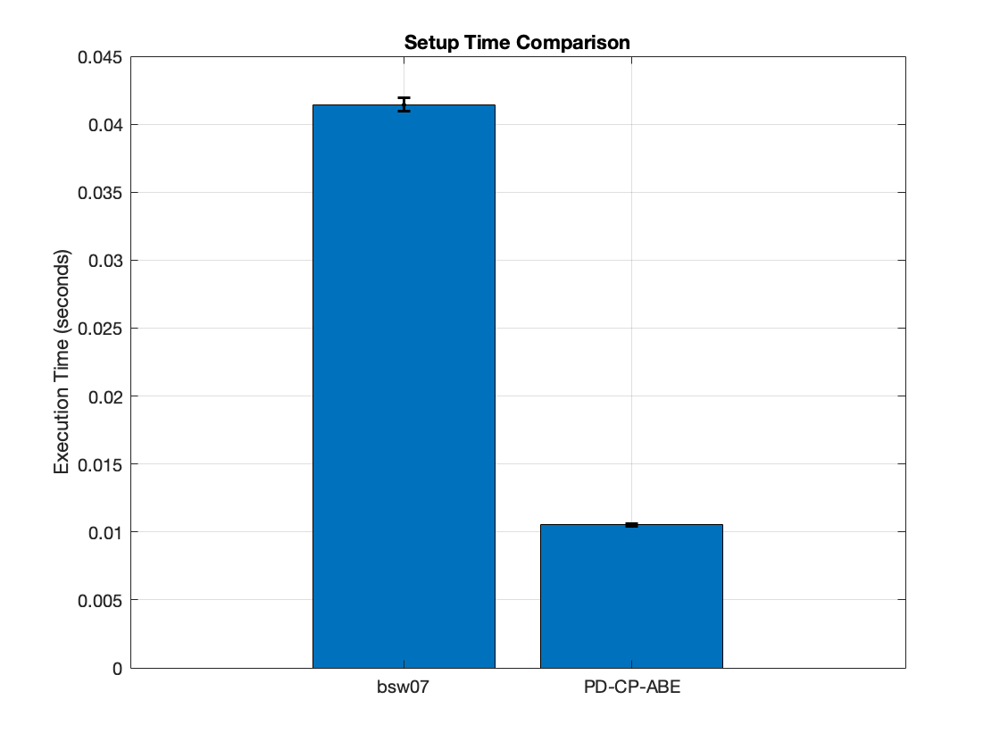
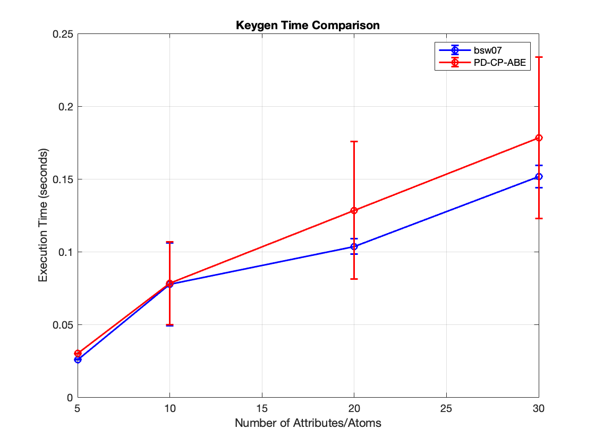
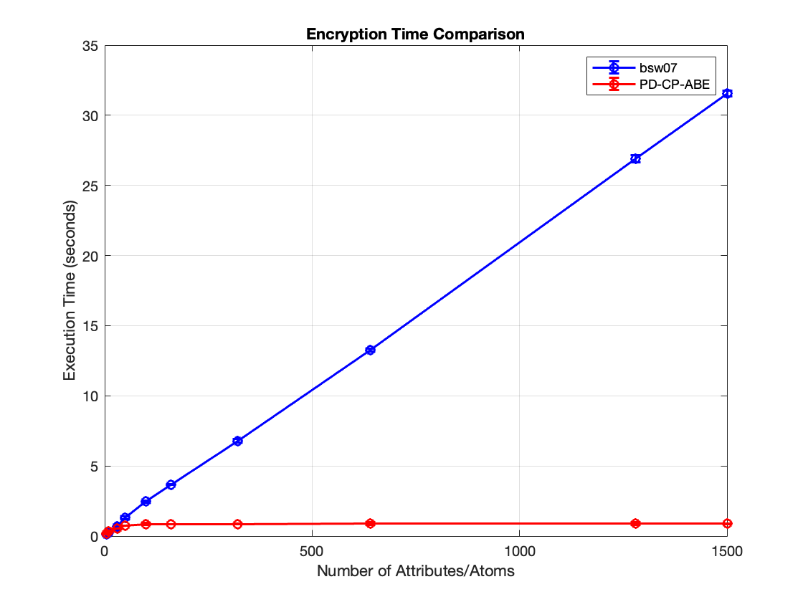
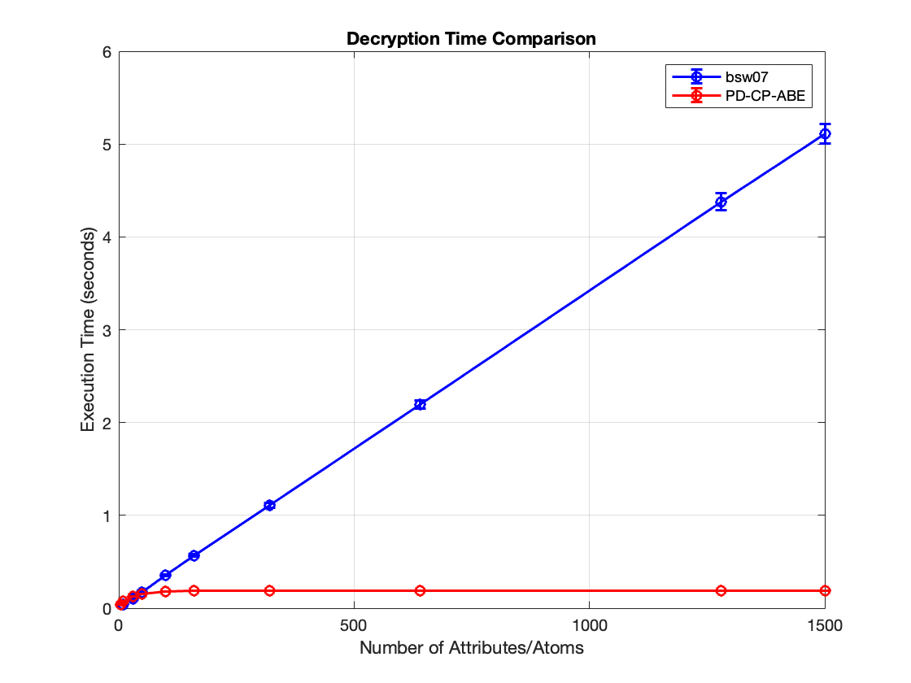

# Partially Decryptable Ciphertext Policy Attribute-Based Encryption (CP-ABE) Scheme

[](https://www.python.org/downloads/release/python-3717/)
[](https://jhuisi.github.io/charm/)
[](https://hub.docker.com/repository/docker/xinzhang9091/charm-crypto-ubuntu22.04/general)

[](https://codecov.io/github/LimeFavoredOrange/PD-CP-ABE)

[](https://app.getpostman.com/run-collection/23135719-b685e954-bcd1-43e5-95f0-b3038725ad3f?action=collection%2Ffork&source=rip_markdown&collection-url=entityId%3D23135719-b685e954-bcd1-43e5-95f0-b3038725ad3f%26entityType%3Dcollection%26workspaceId%3D1f0a1601-87f1-4963-a3f1-9194ade5e62b)

Welcome to the **Partially Decryptable Ciphertext Policy Attribute-Based Encryption (CP-ABE) Scheme**! This repo implements a CP-ABE scheme that allows for partial decryption, providing fine-grained access control securely and efficiently.🔐

🔗 Link to paper:

<br />

## 📋 Table of Contents

- [About the Project](#about-the-project)
- [ Features and Contributions](#key-features-and-contributions)
- [Getting Started](#getting-started)
- [Examples](#examples)
- [Construction Details](#construction-details)
- [Modified Data Structure](#modified-data-structure)
- [Performance Comparison and Evaluation](#performance-comparison-and-evaluation)
- [Limitations and Future Work](#limitations-and-future-work)
- [How to Contribute](#how-to-contribute)
- [License](#license)
- [Disclaimer](#disclaimer)

<br />

## About the Project

✨ This scheme is a research-based implementation aimed at enhancing data security through attribute-based encryption with partial decryption capabilities. This project leverages advanced cryptographic techniques to ensure that only authorized users can decrypt specific parts of the encrypted data.

<br />

## Key Features and Contributions

- 🔒 **Fine-Grained Access Control**: Specify detailed access policies using attributes.
- 🗂️ **Multi-Message Encryption**: Tailored for scenarios requiring the encryption of multiple messages simultaneously, this scheme allows encryptors to apply a single set of attributes and an access policy across various messages, streamlining the encryption process and improving efficiency.
- 🌲 **Redesigned Access Tree Structure**: We've re-engineered the access tree architecture in CP-ABE to better accommodate the encryption of multiple messages. Nodes within the access tree are optimized to share with different message policies, significantly reducing the overall structural complexity.
- 📈 **Efficient Encryption and Decryption**: Since the nodes can be shared with different sub-tree, our scheme reduces the number of costly bilinear pairing computations, leading to faster and more resource-efficient operations.
- ⚡ **Partial Decryption**: Allow users to decrypt only the parts of the ciphertext they have access to. Input multiple data items, and only a single encrypted output.
- 👥 **User Collusion Resistance**: Building on the solutions proposed in this [paper](https://www.researchgate.net/publication/377791825_CR-FH-CPABE_Secure_File_Hierarchy_Attribute-Based_Encryption_Scheme_Supporting_User_Collusion_Resistance_in_Cloud_Computing), our scheme is supporting user collusion resistance.

<br />

## Getting Started

🚀 You can use any of the following methods to set up the required runtime environment for the scheme. We have also built a Docker image for this environment, and we highly recommend using Docker for quick configuration:

### 🐳 Docker Setup

```bash
# Assume that you have already installed Docker on your local device.
# More info: https://docs.docker.com/engine/install/

# Pull the image from Docker Hub
docker pull xinzhang9091/charm-crypto-ubuntu22.04

# Start the Docker container
docker run -it xinzhang9091/charm-crypto-ubuntu22.04

# Clone the GitHub repo
git clone https://github.com/LimeFavoredOrange/PD-CP-ABE.git

# Get into the repo and play around with it
cd PD-CP-ABE
```

### 📝 Script Setup

```bash
# Testing OS: Ubuntu-22.04.4-desktop-amd64
# Assume your desktop path is <DESKTOP_PATH>, please substitute it to the corresponding value

# Clone the repo
git clone https://github.com/LimeFavoredOrange/PD-CP-ABE.git

# Get into the directory
cd CPABE/Setup/

# Run the setup script
bash install.sh

# Test whether the installation is successful
# Some tests will be skipped, but it should pass almost all the tests
make test

# Go back to the repo and play around with it
cd <DESKTOP_PATH>/PD-CP-ABE
```

The above script sets up the dependencies and environment required to run charm-crypto. It primarily includes:

- Python 3.7.17 [https://www.python.org/downloads/release/python-3717/]
- Pyparsing [http://pyparsing.wikispaces.com/]
- GMP 5.x [http://gmplib.org/]
- PBC (latest) [http://crypto.stanford.edu/pbc/news.html]
- OPENSSL [http://www.openssl.org/]

### 🔥 Interactive Server Deployment

To give users a hands-on experience with our scheme, we have deployed a simple server that allows you to quickly explore the functionality of our solution. You can fork the API collection using the Postman button below. The server currently supports the following features:

[](https://app.getpostman.com/run-collection/23135719-b685e954-bcd1-43e5-95f0-b3038725ad3f?action=collection%2Ffork&source=rip_markdown&collection-url=entityId%3D23135719-b685e954-bcd1-43e5-95f0-b3038725ad3f%26entityType%3Dcollection%26workspaceId%3D1f0a1601-87f1-4963-a3f1-9194ade5e62b)

1. **Hello Check**: This endpoint checks if the server is running properly. If everything is operational, the server will return "Hello, World!!!" as the response.
2. **Generate Access Key**: This feature generates an access key based on the provided attribute set and user information. After receiving the response, save the access key locally by using the save option in the upper right corner of the Postman response window. The access key is returned as a JSON file.
3. **Encryption**: Encrypt the provided information using this feature. Once the response is received, save the encrypted data locally through the Postman response window. The encrypted data is returned as a ZIP file.
4. **Decryption**: This feature decrypts the encrypted information. After receiving the response, save the decrypted data locally through the Postman response window. The decrypted data is returned as a JSON file.

#### How to Save Responses Locally:

<div align="center">
  
</div>

#### Simulated Operations:

<a href="https://www.youtube.com/watch?v=NA63dnvjC-M">
    
</a>

Please note that this server is a simple deployment hosted on an old desktop, so its performance might be limited. However, within the `Server` directory of this repository, we have provided a basic server script that you can run on your local machine to simulate the server interactions. (And you need to install flask on your local environment)

<br/>

## Examples

Dive into the practical application of our CP-ABE scheme with the `example.py` script located in the `Examples` folder. This script is your gateway to experimenting with the full capabilities of our encryption system. Follow these steps to see the scheme in action:

### Setup

Initialize the encryption scheme's parameters with `setup`. This prepares the system by setting up the initial environment parameters.

```python
# Setup the scheme
mpk, msk = target.setup()
```

### Key Generation

Generate private access keys based on a set of attributes with Key Generation. This function crafts keys that are pivotal for decrypting messages encrypted under corresponding policies.

```python
# The variable is used to represent the user's attributes
user_attributes = ["A", "B"]

# The variable is used to represent the user's ID, which can be uniquely identified by the system
# I use the user's name as the user's ID in this example, to make it easier to understand
user_name = "Alice"

# Generate the key for the user
key = target.keygen(mpk, msk, user_attributes, user_name)
```

### Export Key to File

Save the generated private keys locally using export_key_to_file. The keys are stored in the same directory as key.pkl, ensuring they are readily available for future decryption processes.

```python
abe_utils.export_key_to_file(target.group, "key", key)
```

### Encrypt

Encrypt a list of messages with corresponding access policies using encrypt. This function secures your data under the defined conditions, making sure only those with matching attributes can decrypt it.

```python
ct, data = target.encrypt(mpk, messages, access_policies)
```

### Export Ciphers to File

After encryption, export the ciphertexts to local storage with export_ciphers_to_file. It creates a folder named after the provided name and saves ciphers.pkl and data.pkl inside it, encapsulating all necessary encrypted data.

```python
 # Save the ciphertext to a file
abe_utils.export_ciphers_to_file(target.group, ct, data, "ciphers")
```

### Read data from File

Load a previously saved access key from a local file with read_key_from_file.
Retrieve the encrypted messages from local storage using read_ciphers.

```python
# Read the key from the file
key = abe_utils.read_key_from_file(target.group, "key")

# Read the ciphertext from the file
ct, data = abe_utils.read_ciphers(target.group, "ciphers")
```

### Decrypt

Attempt to decrypt the loaded ciphertexts using the decrypt function.

```python
result = target.decrypt(data, key, ct)
```

### 🛠️ Run your own Tests

At the beginning of example.py, several variables are initialized to provide encryption data. Feel free to modify these to fit your testing needs.



## Construction Details

Dive into the architecture of our Partially Decryptable Ciphertext Policy Attribute-Based Encryption (CP-ABE) Scheme. This section breaks down the main functions of the scheme, providing insights into its implementation and operational mechanics.

### Setup

The `Setup(λ) → (MPK, MSK)` function is run by the service provider (SP) for system initialization. The SP inputs a security parameter $`\lambda`$ and selects a bilinear mapping $`e :\ G_0 \times G_0 \rightarrow G_T `$ with a cyclic multiplicative group $`G_0`$, a generator $`g`$, and a prime order $`p`$. This algorithm defines the hash functions as follows:

- $`H_1:\ \{0,1\}^* \rightarrow G_0`$
- $`H_2:\ G_T \rightarrow \mathbb{Z}_p`$
- $`H_3:\ \{0,1\}^* \rightarrow \mathbb{Z}_p`$

The CA randomly selects $\alpha,\ \beta_1,\ \beta_2,\ \beta_3 \in \mathbb{Z}_p$ and constructs the Master Public Key (`MPK`) as:

$$
\text{MPK} = \{g,\ G_0,\ H_1,\ H_2,\ f_1 = g^{\beta_1},\ f_2 = g^{\beta_2},\ f_3 = g^{\beta_3},\ e(g,\ g)^\alpha\}
$$

Then, the CA sets the following:

- $h_1 = g^{\beta_1^{-1}}$
- $h_2 = g^{\beta_2^{-1}}$
- $h_3 = g^{\beta_3^{-1}}$

Finally, the CA randomly chooses $\theta \in \mathbb{Z}_p$ as the value for the file hierarchy, and the Master Secret Key (`MSK`) is defined as:

$$
\text{MSK} = \{\alpha,\ \beta_1,\ \beta_2,\ \beta_3,\ \theta,\ H_3\}
$$

### Key Generation (keygen)

The `keygen(MPK, MSK, S_i) → (SK_i)` function is executed by the `data owner (DO)` to generate private keys for users. For the $i$-th user with identification $uid$, the CA randomly chooses $r_i$ and $`\omega_1 \in \mathbb{Z}_p`$, where $`\omega_1 = H_3(uid)`$ for the user, and $`r_{i,j} \in \mathbb{Z}_p`$ (for $`j \in [1, N_i]`$) for each attribute in the user's attribute set $`S_i = \{att_{i,1}, \ldots, att_{i,N_i}\}`$. The CA then computes the private key $SK_i$ as:

$$
\{ D_i = g^{\frac{\alpha + \theta}{\beta_1}}, \quad E_i = g^{\frac{\theta + r_i + \omega_1}{\beta_2}}, \quad E'_i = g^{\frac{r_i + \omega_1}{\beta_3}} \}
$$

For all $`j \in [1, N_i]`$, the CA computes:

```math
\forall j \in [1, N_i]: \ \  \hat{D}_{i,j} = g^{r_{i} + \omega_1} H_1(att_{i,j})^{r_{i,j}},\  \quad \check{D}_{i,j} = g^{r_{i,j}}
```

### Encryption

The `Encrypt(MPK, cki, T) → (CT)` function is executed by the data owner (DO) for encryption. The DO randomly selects $`\kappa`$ symmetric keys $`ck = \{ck_1, ck_2, \ldots, ck_\kappa\}`$ to encrypt the corresponding $`\kappa`$ messages $`E_{ck}(M) = \{E_{ck_1}(M_1), E_{ck_2}(M_2), \ldots, E_{ck_\kappa}(M_\kappa)\}`$, and hierarchically encrypts the symmetric keys $`ck`$. DO set up a hierarchical access control tree $`T`$ and associates each symmetric key $`ck_i`$ ($`i = 1, \ldots, \kappa`$) with a level node $`L_i`$ in $`T`$, where $`s_i \in \mathbb{Z}_p`$ is the secret number corresponding to the level nodes. Moreover, the DO randomly chooses a data noise vector $`\varepsilon = \{\varepsilon_1, \varepsilon_2, \ldots, \varepsilon_\kappa\}`$ ($`\varepsilon_i \in \mathbb{Z}_p`$ for each level node $`L_i`$). Then, it calculates the level ciphertexts as:

```math
\forall i \in L_i: C_{L_i} = ck_i \cdot e(g, g)^{\alpha(s_i + \varepsilon_i)}, \quad C'_{L_i} = f_1^{(s_i + \varepsilon_i)}, \quad C''_{L_i} = f_2^{(s_i + \varepsilon_i)}, \quad C'''_{L_i} = f_3^{\varepsilon_i}
```

Next, the DO chooses a $`(k_x - 1)`$-order polynomial function $`q_x()`$, and assigns values beginning from $`T`$'s root node. DO sets $`q_x(0) = s_i`$ when $`x`$ is a level node for $`ck_i`$. Otherwise, $`q_x(0) = q_{\text{parent}(x)}(\text{index}(x))`$. We suppose that $`\mathbb{X}`$ is the leaf node set in $`T`$. DO chooses the attribute $`att(x) \in \mathbb{X}`$, and calculates the attribute ciphertexts as:

```math
\hat{C}_x = g^{q_x(0)}, \quad \check{C}_x = H_1(att(x))^{q_x(0)}
```

### Decryption

The `Decrypt(MPK, CT, SK_i) → (ck_i)` function is executed by the data user (DU) to decrypt the ciphertext. DU computes $`F_x`$ using the following steps:

#### For each leaf node $x$ with $`att_{i,j} = att(x)`$:

```math
F_x = \text{DecryptNode}(SK, CT, x) = \frac{e\left(\hat{D}_{i,j}, \hat{C}_x\right)}{e\left(\check{D}_{i,j}, \check{C}_x\right)}
= \frac{e\left(g^{r_{i} + \omega_1} H_1(att_{i,j})^{r_{i,j}}, g^{q_x(0)}\right)}{e\left(g^{r_{i,j}}, H_1(att(x))^{q_x(0)}\right)}
= e\left(g, g\right)^{\left(r_{i,j} + \omega_1\right)q_x(0)}
```

#### For non-leaf node $`x`$, DU calculates $`F_x`$ with the Lagrange coefficient $`\Delta_{i,S'_x}(0)`$ and $`F_z`$:

```math
F_x = \prod_{z \in S_x} F_z^{\Delta_{i,S'_x}(0)}
= \prod_{z \in S_x} \left(e\left(g, g\right)^{\left(r_{i,j} + \omega_1\right)q_x(0)}\right)^{\Delta_{i,S'_x}(0)}
= e\left(g, g\right)^{\left(r_{i,j} + \omega_1\right)q_x(0)}
```

If DU's attribute set meets the part or whole hierarchical tree $`T`$ at $`T_{L_i}`$, DU can get the corresponding $`F_{L_i}`$ of the level nodes $`L_i`$. Then, DU calculates $`\tilde{F}_i`$:

```math
\tilde{F}_i = \frac{e\left(C'_{L_i}, D_i\right) \cdot e\left(C'''_{L_i}, E'_i\right) \cdot F_{L_i}}{e\left(C''_{L_i}, E_i\right)}
= \frac{e\left(f_1^{(s_i + \epsilon_i)}, g^{\frac{\alpha + \theta}{\beta_1}}\right) \cdot e\left(f_3^{\epsilon_i}, g^{\frac{r_i + \omega_1}{\beta_3}}\right) \cdot e\left(g, g\right)^{(r_i + \omega_1)s_i}}{e\left(f_2^{(s_i + \epsilon_i)}, g^{\frac{\theta + r_i + \omega_1}{\beta_2}}\right)}
= e\left(g, g\right)^{\alpha(s_i + \epsilon_i)}
```

Finally, DU recovers $`ck_i`$ as follows:

```math
\frac{C_{L_i}}{\tilde{F}_i} = \frac{ck_i \cdot e\left(g, g\right)^{\alpha(s_i + \epsilon_i)}}{e\left(g, g\right)^{\alpha(s_i + \epsilon_i)}} = ck_i
```

## Modified Data Structure

In the `PD-CP-ABE` scheme, we have redesigned the data structure used to represent access structures, which plays a crucial role in generating encryption parameters and implementing access control during the encryption and decryption processes. The access structure is typically represented as a `tree` in traditional CP-ABE. The root node corresponds to the symmetric encryption key, leaf nodes represent attribute nodes, and intermediate nodes are threshold nodes that connect other nodes. For example, if the access policy is `(Family and Trusted) or (Manager and Legal)` and `(Family and Trusted) or (Manager or Legal)`, the corresponding access tree would look like this:

<div align="center">
  
</div>

Now, consider a scenario where there are `N` messages to be encrypted, each with a corresponding access policy. This would result in `N` separate access policies, each generating its access tree, leading to `N` encrypted files.

Traditional schemes do not account for the scenario of encrypting multiple messages simultaneously. In our scheme, we address this by redesigning the data structure and integrating features of both linked lists and tree structures. This new design allows for the use of a single integrated tree to encapsulate all different access policies. As a result, even if there are `N` messages to be encrypted, only one access tree is needed, resulting in a single encrypted file.

Our modified data structure enables the integration of multiple access policies and leverages the shared structure properties to speed up the encryption and decryption processes. This is achieved by reusing computation results from shared nodes.

For the same access policy, `(Family and Trusted) or (Manager and Legal)` and `(Family and Trusted) or (Manager or Legal)`, our data structure is as follows:

<div align="center">
 
</div>

In our data structure, there is no longer a single root node. Instead, each key pair is associated with the corresponding atom node. The process begins by generating an atom node for each key. Next, we extract the attribute set $`A`$ from the access policy set provided by the user, for each element $`a`$ in $`A`$, an attribute node is created. Finally, depending on the requirements, each atom node is linked with the appropriate nodes according to its specific access policy.

## Performance Comparison and Evaluation

To assess the performance of our encryption scheme, we deployed it on a machine with the following configuration:

- **CPU**: Intel(R) Xeon(R) CPU E5-2420 v2 @ 2.20GHz
- **Memory**: 64 GB DDR3
- **Operating System**: Debian GNU/Linux 12 (bookworm)

We compared our scheme against the foundational CP-ABE scheme proposed by John Bethencourt, Amit Sahai, and Brent Waters ([link](https://ieeexplore.ieee.org/document/4223236)). For this comparison, we refer to their scheme as **bsw07**. The following functionalities were tested through practical runs:

- **Setup**: A basic test to measure the initialization performance of the schemes.
- **Keygen**: Performance was tested using 5, 10, 20, and 30 attributes as parameters for key generation.
- **Encryption/Decryption**: Performance was tested using varying numbers of messages (5, 10, 30, 50, 100, 160, 320, 640, 1280, and 1500) as input. To simulate real-world scenarios, approximately and randomly 50 messages shared the same access policy.

Each test was run 10 times, and the average result for each was calculated. The data obtained from these tests is presented in the following charts:

|         **Setup Performance**         |         **Keygen Performance**          |
| :-----------------------------------: | :-------------------------------------: |
|  |  |

|           **Encryption Performance**            |           **Decryption Performance**            |
| :---------------------------------------------: | :---------------------------------------------: |
|  |  |

### Setup Time Comparison

| Scheme    | Average Execution Time (s) | Standard Deviation (s) | Median Execution Time (s) |
| --------- | -------------------------- | ---------------------- | ------------------------- |
| bsw07     | 0.041434                   | 0.000498               | 0.041600                  |
| PD-CP-ABE | 0.010532                   | 0.000093               | 0.010526                  |

### Keygen Time Comparison

| Attributes/Atoms | Scheme    | Average Execution Time (s) | Standard Deviation (s) | Median Execution Time (s) |
| ---------------- | --------- | -------------------------- | ---------------------- | ------------------------- |
| 5                | bsw07     | 0.025796                   | 0.000137               | 0.025766                  |
| 5                | PD-CP-ABE | 0.029930                   | 0.000063               | 0.029921                  |
| 10               | bsw07     | 0.077731                   | 0.028465               | 0.070258                  |
| 10               | PD-CP-ABE | 0.078379                   | 0.028437               | 0.071980                  |
| 20               | bsw07     | 0.103540                   | 0.005346               | 0.101476                  |
| 20               | PD-CP-ABE | 0.128467                   | 0.047085               | 0.100659                  |
| 30               | bsw07     | 0.151705                   | 0.007741               | 0.146871                  |
| 30               | PD-CP-ABE | 0.178180                   | 0.055502               | 0.150279                  |

### Encryption Time Comparison

| Attributes/Atoms | Scheme    | Average Execution Time (s) | Standard Deviation (s) | Median Execution Time (s) |
| ---------------- | --------- | -------------------------- | ---------------------- | ------------------------- |
| 5                | bsw07     | 0.151322                   | 0.004748               | 0.148440                  |
| 5                | PD-CP-ABE | 0.165196                   | 0.053204               | 0.137183                  |
| 10               | bsw07     | 0.249540                   | 0.002493               | 0.248810                  |
| 10               | PD-CP-ABE | 0.316717                   | 0.056390               | 0.288832                  |
| 30               | bsw07     | 0.689024                   | 0.003680               | 0.687811                  |
| 30               | PD-CP-ABE | 0.542301                   | 0.001850               | 0.541834                  |
| 50               | bsw07     | 1.306776                   | 0.114855               | 1.249850                  |
| 50               | PD-CP-ABE | 0.729781                   | 0.005455               | 0.727972                  |
| 100              | bsw07     | 2.458105                   | 0.092807               | 2.427438                  |
| 100              | PD-CP-ABE | 0.858643                   | 0.084340               | 0.830338                  |
| 160              | bsw07     | 3.672614                   | 0.023932               | 3.662233                  |
| 160              | PD-CP-ABE | 0.857414                   | 0.005710               | 0.855492                  |
| 320              | bsw07     | 6.790536                   | 0.123901               | 6.748860                  |
| 320              | PD-CP-ABE | 0.861576                   | 0.016801               | 0.855744                  |
| 640              | bsw07     | 13.253056                  | 0.108999               | 13.186858                 |
| 640              | PD-CP-ABE | 0.887924                   | 0.084230               | 0.859781                  |
| 1280             | bsw07     | 26.905652                  | 0.269045               | 26.797514                 |
| 1280             | PD-CP-ABE | 0.892573                   | 0.084457               | 0.864324                  |
| 1500             | bsw07     | 31.552992                  | 0.199178               | 31.470533                 |
| 1500             | PD-CP-ABE | 0.871881                   | 0.016854               | 0.866368                  |

### Decryption Time Comparison

| Attributes/Atoms | Scheme    | Average Execution Time (s) | Standard Deviation (s) | Median Execution Time (s) |
| ---------------- | --------- | -------------------------- | ---------------------- | ------------------------- |
| 5                | bsw07     | 0.039626                   | 0.002317               | 0.039823                  |
| 5                | PD-CP-ABE | 0.035808                   | 0.000097               | 0.035819                  |
| 10               | bsw07     | 0.039665                   | 0.001077               | 0.039295                  |
| 10               | PD-CP-ABE | 0.070226                   | 0.000217               | 0.070216                  |
| 30               | bsw07     | 0.098162                   | 0.002947               | 0.097221                  |
| 30               | PD-CP-ABE | 0.129051                   | 0.001769               | 0.128305                  |
| 50               | bsw07     | 0.170649                   | 0.004676               | 0.169118                  |
| 50               | PD-CP-ABE | 0.150873                   | 0.000244               | 0.150878                  |
| 100              | bsw07     | 0.354277                   | 0.010101               | 0.349085                  |
| 100              | PD-CP-ABE | 0.181611                   | 0.000216               | 0.181640                  |
| 160              | bsw07     | 0.567469                   | 0.011939               | 0.562536                  |
| 160              | PD-CP-ABE | 0.187640                   | 0.000217               | 0.187663                  |
| 320              | bsw07     | 1.108902                   | 0.024803               | 1.096368                  |
| 320              | PD-CP-ABE | 0.189139                   | 0.000384               | 0.189170                  |
| 640              | bsw07     | 2.194026                   | 0.043844               | 2.176572                  |
| 640              | PD-CP-ABE | 0.189400                   | 0.000239               | 0.189345                  |
| 1280             | bsw07     | 4.378460                   | 0.093277               | 4.344427                  |
| 1280             | PD-CP-ABE | 0.190331                   | 0.000626               | 0.190113                  |
| 1500             | bsw07     | 5.111895                   | 0.104495               | 5.064959                  |
| 1500             | PD-CP-ABE | 0.190233                   | 0.000253               | 0.190196                  |

When comparing the two encryption schemes, `bsw07` and `PD-CP-ABE`, we not only focus on the average execution time, but also consider multiple aspects, including variance analysis, execution time stability, and scalability with different attributes/atom numbers.

- Setup Time Analysis:
  - Average Execution Time: The `PD-CP-ABE` scheme significantly outperforms `bsw07` in setup time, with an average execution time of 0.010532 seconds compared to 0.041434 seconds for `bsw07`.
  - Variance (Standard Deviation): The standard deviation for `PD-CP-ABE` (0.000093 seconds) is considerably lower than that for `bsw07` (0.000498 seconds), suggesting that `PD-CP-ABE` not only executes faster but also does so with greater consistency and predictability.


- Key Generation (Keygen) Analysis:
  - Performance at Lower Attribute Levels (5 and 10): At 5 attributes, `bsw07` exhibits a marginally faster average execution time (0.025796 seconds) compared to `PD-CP-ABE` (0.029930 seconds).
  - Performance at Higher Attribute Levels (20 and 30): As the complexity increases (20 and 30 attributes), bsw07 maintains a performance advantage with lower average execution times (0.103540 seconds and 0.151705 seconds, respectively) compared to `PD-CP-ABE` (0.128467 seconds and 0.178180 seconds).


- Encryption Performance
  - Scalability and Efficiency: For a smaller number of atoms (5 and 10), `bsw07` is slightly more efficient, with lower average encryption times. However, as the number of atoms increases (from 30 atoms onwards), `PD-CP-ABE` becomes more efficient, offering significantly lower encryption times.
  - Consistency: The standard deviation for `PD-CP-ABE` is generally higher than for `bsw07` at a smaller number of atoms, indicating more variability in performance. However, as the number of atoms increases, the standard deviation of `PD-CP-ABE` remains relatively stable, indicating consistent performance despite the increased complexity.


- Decryption Performance
  - Performance Across atom Levels: Across all the atom levels, `PD-CP-ABE` consistently outperforms `bsw07` in decryption time. The difference is particularly notable at higher atom levels (640, 1280, 1500), where `PD-CP-ABE` decrypts in approximately 0.19 seconds, while `bsw07` takes significantly longer (up to 5.111895 seconds at 1500 atoms).
  - Variance: The standard deviation for `PD-CP-ABE` remains extremely low across all atom levels, demonstrating that its decryption performance is not only faster but also highly consistent.

### Evaluation

- In the initial setup phase of the encryption scheme, `PD-CP-ABE` not only outperforms bsw07 in performance, but its execution time is also more stable, indicating that our scheme is very efficient in the deployment phase and does not require high computing power in the deployment environment.
- In the key generation phase, `bsw07` performs better than `PD-CP-ABE`, especially when the key has more attributes. However, the difference between the two is not large, the difference is less than 1 second. Compared with the performance difference between the two in encryption and decryption, we believe that the performance difference in key generation has minimal impact.
- Encryption/Decryption: The choice between `bsw07` and `PD-CP-ABE` for encryption depends on the complexity of the task. For low-complexity tasks, `bsw07` may offer slightly better performance, but as the complexity increases, `PD-CP-ABE` provides substantial efficiency gains.

In conclusion, the `PD-CP-ABE` scheme demonstrates clear advantages for applications that require `CP-ABE` encryption of multiple messages, such as digital wills. Not only does it offer efficient system setup, but it also provides superior performance in both encryption and decryption, particularly as the number of messages or the number of shared access policies increases. Although `PD-CP-ABE` exhibits relatively weaker performance in key generation compared to `bsw07`, the impact on overall scheme efficiency is minimal when weighed against its other performance benefits.

## Limitations and Future Work

Currently, the `PD-CP-ABE` scheme supports access control based solely on the presence or absence of attributes about the access policy. While this is effective for many scenarios, it limits the expressiveness of the access control. A significant area for future work is the extension of the scheme to support attribute-based conditions that involve specific attribute values. For example, instead of simply verifying the existence of an "age" attribute, the scheme could be enhanced to evaluate conditions such as `age > 20`. This would allow for more granular and dynamic access control policies.

## How to Contribute

👋 Contributions are welcome! If you would like to contribute to the development of this project, please follow these steps:

1. Fork the repository.
2. Create a new branch (`git checkout -b feature/YourFeature`).
3. Commit your changes (`git commit -m 'Add some feature'`).
4. Push to the branch (`git push origin feature/YourFeature`).
5. Open a pull request.

Please make sure to update tests as appropriate.

## License

Distributed under the MIT License. See `LICENSE` for more information.

## Disclaimer

This project is intended solely for research and academic purposes. The implementations provided here are proof-of-concept and have not been optimized or thoroughly tested for use in production environments. The authors have performed corresponding unit tests on the scheme and obtained 100% test coverage. For details, please click the codecov link at the top.

Users should be aware that applying this code in a production setting carries inherent risks, including but not limited to potential security vulnerabilities and performance inefficiencies. By using this code, you acknowledge that any use of this project in a production environment is at your own risk, and the authors of this project are not responsible for any damages or losses that may occur. We recommend conducting thorough testing and reviews if you intend to adapt this work for any production-level applications.

